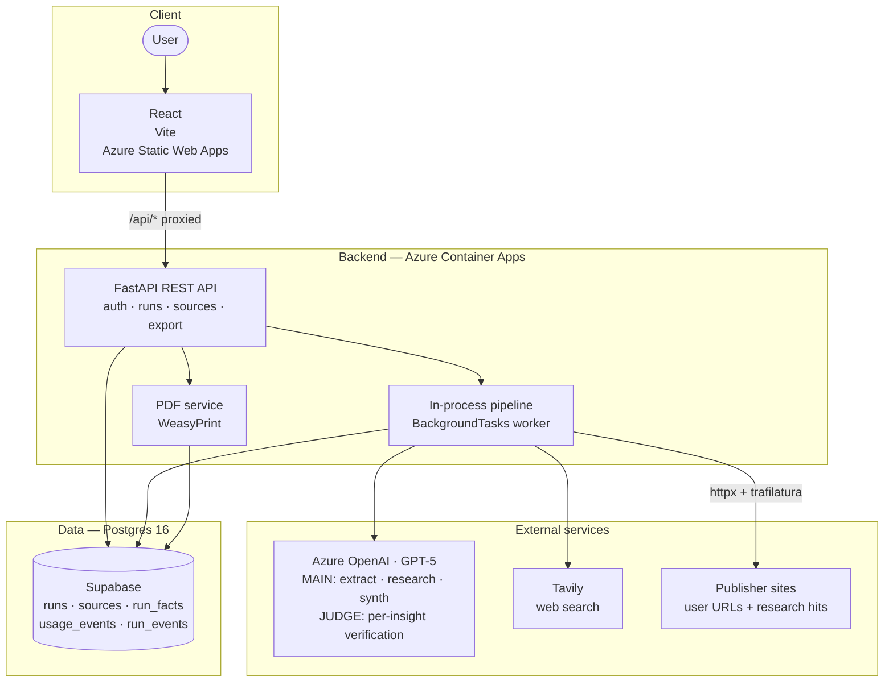
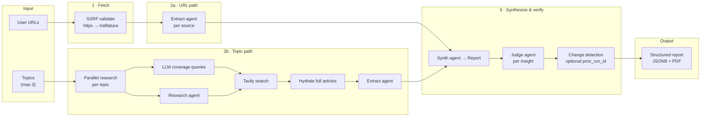
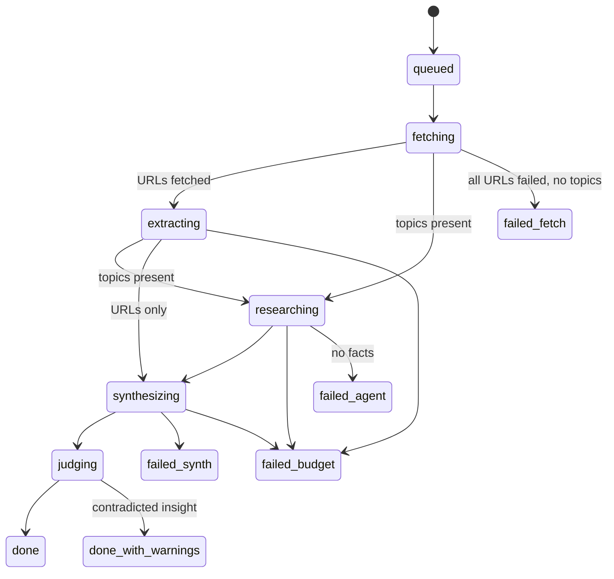

# Market Research Intelligence Assistant — Design

Full system design for the three-phase build (MVP → auth/observability → polish/deploy). Phase 3 complete.

**LLM:** All agent phases (extract, research, coverage queries, synthesis, judge) call **GPT-5** through Azure OpenAI deployments — configured via `AZURE_OPENAI_MAIN_DEPLOYMENT` and `AZURE_OPENAI_JUDGE_DEPLOYMENT`.

## Quick reference

- **Prompts**: [prompts.md](prompts.md)
- **API surface**: FastAPI auto-docs at `/docs` when backend is running

## High-level views

### 1. System architecture



| Layer | Role |
|-------|------|
| **Frontend** | React + Vite + TypeScript → Azure Static Web Apps; `/api/*` proxied to backend. |
| **Backend** | FastAPI + in-process `BackgroundTasks` pipeline → Azure Container Apps (Linux container from ACR). |
| **AI framework** | Pydantic AI (structured output, tools, `@output_validator`). |
| **LLM** | **GPT-5** via Azure OpenAI — `AZURE_OPENAI_MAIN_DEPLOYMENT` (extract / research / synth / coverage queries), `AZURE_OPENAI_JUDGE_DEPLOYMENT` (judge). |
| **Search** | Tavily inside the research agent `search` tool and coverage query bootstrap. |
| **Database** | Postgres 16 — docker-compose locally; Supabase (session pooler) in production. |
| **Auth** | Argon2id + JWT (httpOnly cookies); rate limits on login and run creation. |
| **Observability** | structlog → stdout + `usage_events`, `run_events`, `app_events`. |
| **Export** | Jinja2 HTML → WeasyPrint PDF (`GET /runs/{id}/export.pdf`). |

### 2. AI pipeline (hybrid)



- **URL path**: SSRF validate → httpx fetch (500KB cap) → trafilatura → token cap → per-source extract agent.
- **Topic path**: parallel per-topic tasks → LLM coverage queries + research agent + Tavily → hydrate articles → extract.
- **Synth**: single agent → `Report` JSONB; citation validator retries on fabricated `source_id`s.
- **Judge**: per-insight verdict + rationale; flagged in UI, never dropped.
- **Diff**: optional `prior_run_id` → claim hash tags (`new` / `unchanged` / `removed`).

### 3. Run state machine



Text equivalent:

```
queued → fetching → extracting → researching → synthesizing → judging → done | done_with_warnings
                ↓             ↓             ↓
          failed_fetch    failed_agent  failed_synth | failed_budget
```

Every transition writes a `run_events` row.

### 4. Data model

- `users`, `runs`, `sources`, `run_facts`, `usage_events`, `run_events`, `app_events`
- Report stored as JSONB on `runs.report`; denormalised facts in `run_facts`

### 5. Guardrails

- Input limits (topics, URLs, lengths); SSRF on fetch; XML wrapping for LLM inputs
- Per-run token budget; concurrency semaphores; synth citation validation

### 6. Trade-offs

See [README](../README.md#design-decisions--trade-offs) for the full decision log (pipeline, fetch, research, synth, judge, auth, and UX).
